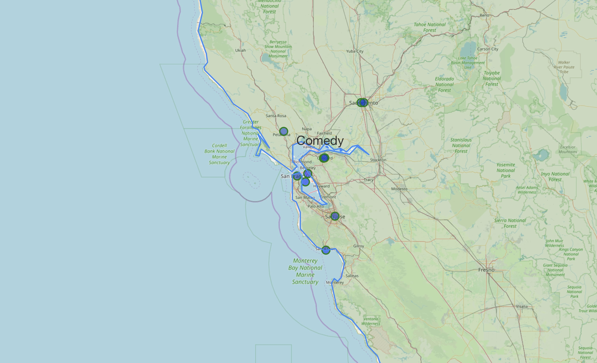
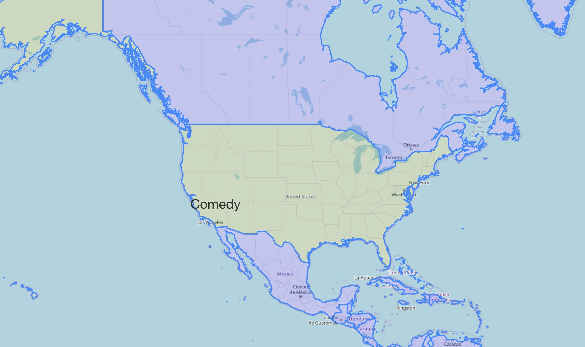
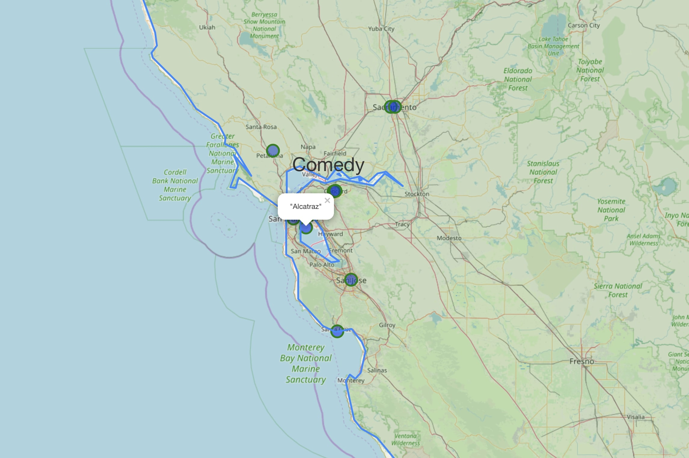
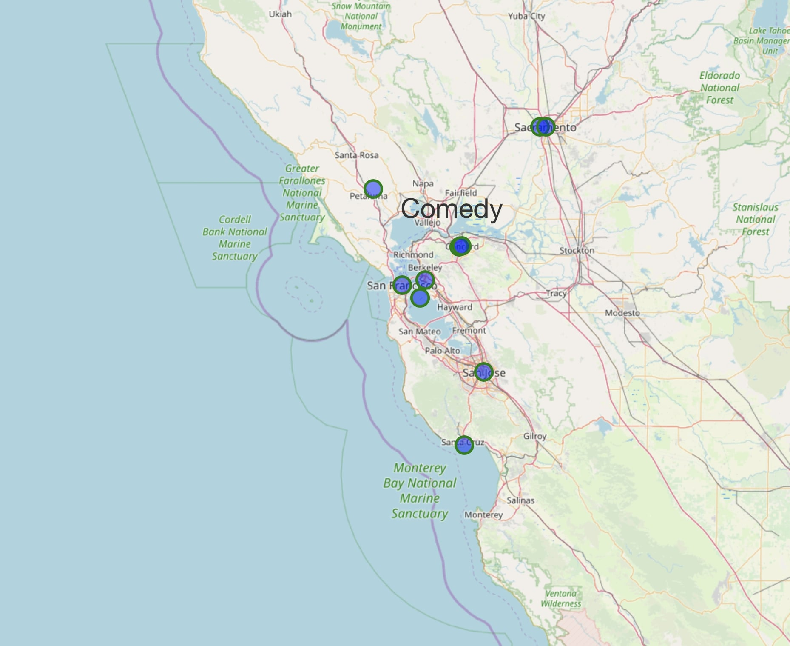
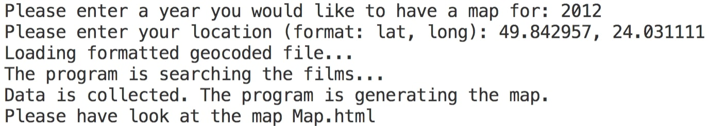

# map_generator

map_generator is a Python module which deals with finding the films that were directed nearby to the given coordinates and prints it out on a map. This layer is called "Films_map". Second layer colours the given country in green and the others in blue. Also, I used csv file I generated in my last homework about IMDB database research about the most popular genre among directed films in the country and printed it out on the layer.

## Pre-installings

Before running the program you will have to install these libraries:
```bash
pip install folium
pip install geocoder
pip install reverse_geocoder
pip install pycountry
```

## Usage

Run the module and write in terminal the desired year and then coordinates. The program will take some time to run, especially when you type the coordinates of US cities, because it is the country with the biggest number of directed films(around 2-3 minutes). Theres is also a file 'coordinates.txt', where you can find some coordinates that I used to test my program, so you can use them or choose your own.

## HTML file

This file contains a map with two layers: the first shows at most 10 markers with the names of films as popups. The second layer are the coloured countries. If you want to see the name of the film, you need to click on the marker, but when the "Genre_map" layer in on, the map can instead zoom out. Therefore it is recommended to turn off the "Genre_map" layer and then click on the markers.






## Running example

>>> Please enter a year you would like to have a map for: 2012
>>> Please enter your location (format: lat, long): 49.842957, 24.031111
Then you will be given some messages that will show you what the program does in the moment.

